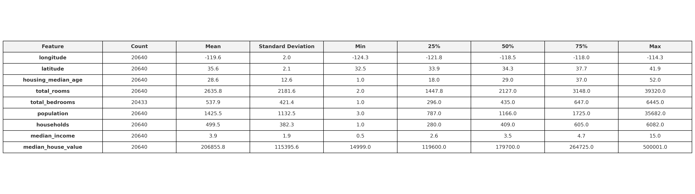
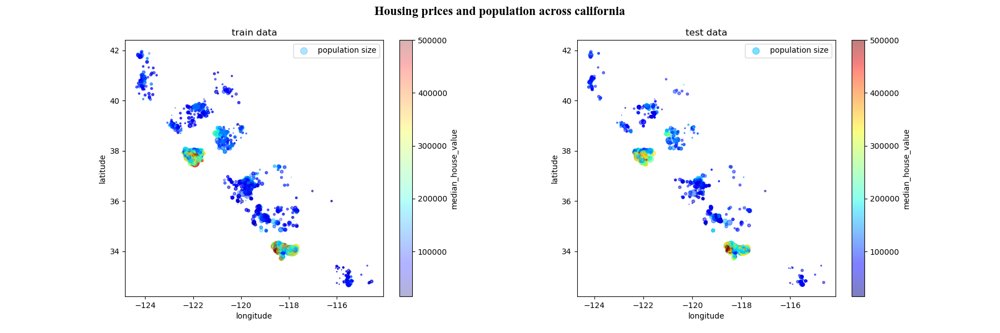
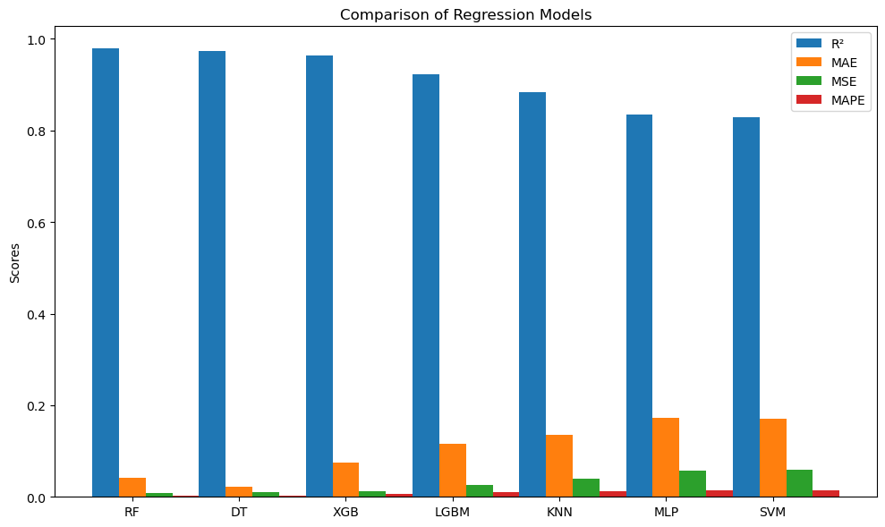

# Aim of the Project:
Project aims to develop an end-end prediction model which could predict median house value in California during 1995.

# Overview of dataset:
The housing prices dataset 🏠 consists of 20640 instances and 10 features, including the target variable "median housing prices".
The remaining 9 features include geographical location, indicated by  latitude and longitude parameters,median,ocean proximity,number of households, population,median income,median age,total number of rooms, total number of bedrooms.

The descriptive statistics provide more insights into the features

# Analysis from the house prices data:

Problems resolved from the analysis in Preprocessing:

Missing Values: The total_bedrooms attribute had missing values in 207 districts, which required imputation.Inorder to minimize the distortion caused by the nan values, median imputation has been chosen.

Skewness: The median housing prices were skewed, suggesting the need for a logarithmic transformation.

Scaling Issues: Features like median income, housing median age, and median house value were capped and scaled, indicating the necessity of standardization.
    
After preprocessing, the data is split into training data and test data constituting 80% and 20% respectively. 

The picture below indicates housing prices(by color) and density of population(by marker size).

# Selection of the model:

However, to find the best regression model that generalizes on unseen data, cross validation strategy has been employed. In this strategy, the regression models are trained on different validation sets and identify the  metrics  R² score,mean absolute error, mean square error and mean absolute percentage error.

# Performance of the Best Model

After cross-validation, the Random Forest Regressor (RF) emerged as the best-performing model with 97.8% R² score,indicating strong predictive accuracy and lowest MAE and MSE.

# Prediction of house prices:
   The trained random forest regression model predicts on unseen/test data with 96.7% R² score
